# 单机百万级别QPS 网络传输

**TLDR**:

- **UDP**
  
  - 3万 qps的时候偶尔会有一两个丢包。
  
  - 5万 qps的时候丢包严重且频繁，不适合做可信赖的网络探测
  
  - 非可信赖的通讯情况下，可以达到接近百万的QPS

- **TCP**
  
  - 3万 qps的时候丢包就比较严重了。TCP重传厉害
  
  - 非可信赖的通讯情况下，可以达到接近280万的QPS （理论还可以增加，但是client CPU已经100%了）

**注意**： "非可信赖" 指的是可能会发生丢包情况，UDP程序要么忽略，要么通过一种机制进行重发。 TCP本身的重传机制可以保证数据不丢。

## 1、背景

测试两台机器之间UDP、TCP通讯的benchmark。

主要探测两个场景

- 满足可信赖的通讯的qps

- 支持的最大qps

## 2、环境设置

client和server连接到同一台Tor，尽量减少网络的干扰。

**客户端机器**: xxx.xxx.xxx.xxx

Intel(R) Xeon(R) Gold 5118 CPU @ 2.30GHz 两颗

12物理核 48个逻辑核

187GB内存

**服务端机器**: xxx.xxx.xxx.xxx

Intel(R) Xeon(R) Gold 5118 CPU @ 2.30GHz 两颗

12物理核 48个逻辑核

187GB内存

设置了网卡多队列。

## 3、UDP 百万 QPS 测试

- 服务端端口 48 个

- 客户端端口 48 个

- 客户端和服务端端口按顺序建立"连接"

**TLDR**: 

- 3万 qps的时候偶尔会有一两个丢包。

- 5万 qps的时候丢包严重且频繁，不适合做可信赖的网络探测

- 非可信赖的通讯情况下，可以达到接近百万的QPS

### 3.1 3万 QPS 压测

client:

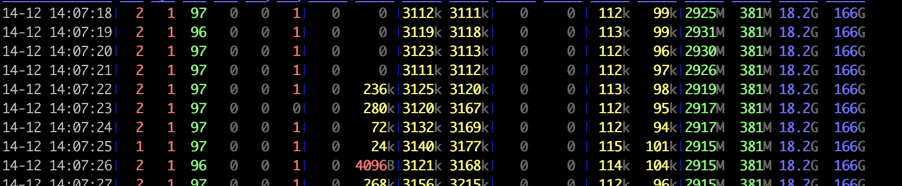

server:

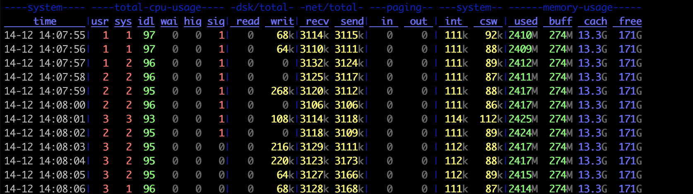

### 3.2 10万 QPS 压测

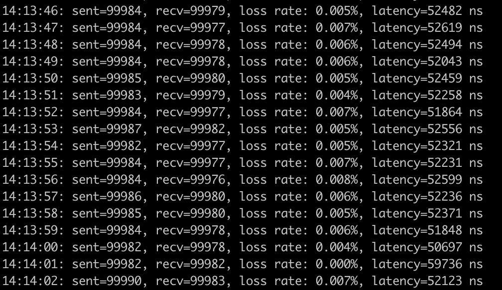

client:

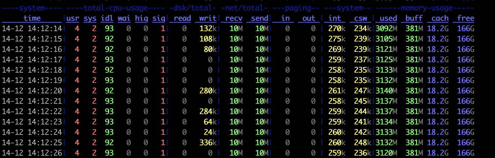

server:

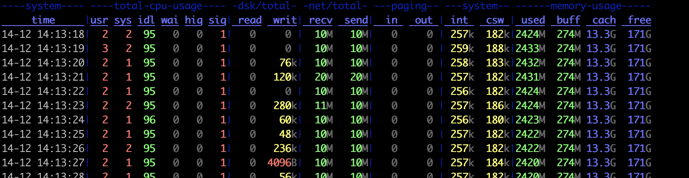

### 3.3 100万 QPS 压测

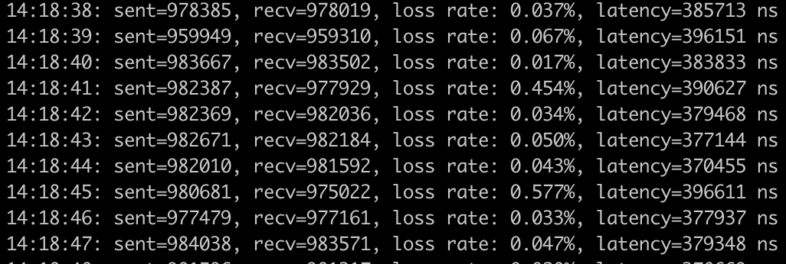

client:

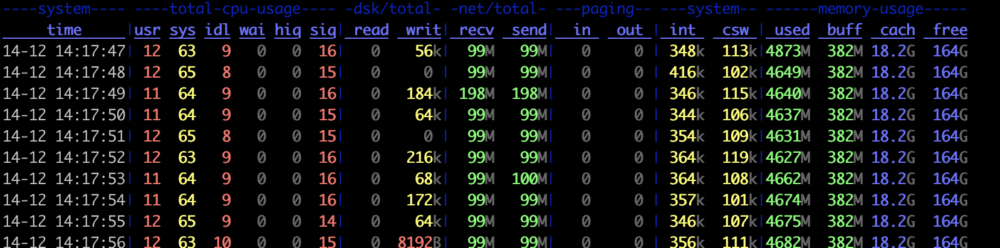

server:

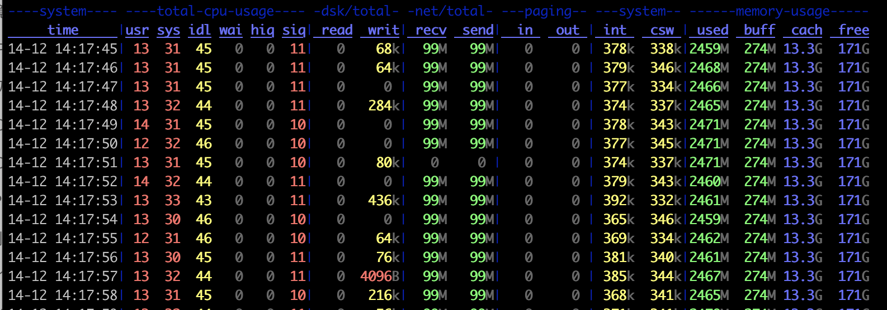

## 4、TCP 百万 QPS 测试

- 服务端端口 48 个

- 客户端端口 48 个

- 客户端和服务端建立48条流

**TLDR**:

- 3万 qps的时候丢包就比较严重了。TCP重传厉害

- 非可信赖的通讯情况下，可以达到接近280万的QPS （理论还可以增加，但是client CPU已经100%了）
  
  

### 4.1  3万 QPS 压测

##### 1. dstat

client:

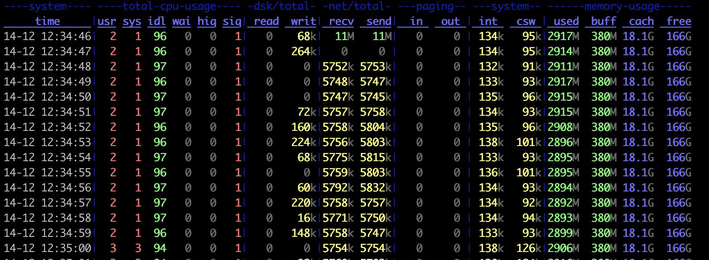

server:

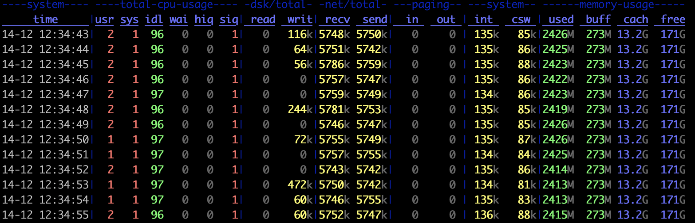

##### 2. client log

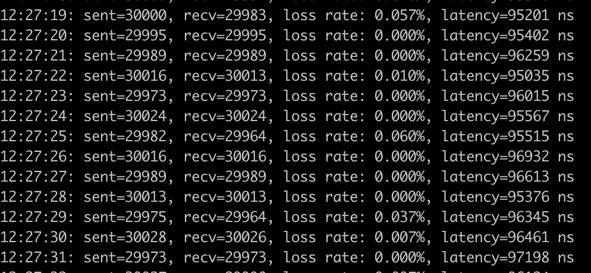

### 4.2 5万 QPS 压测

##### 1. dstat

client:

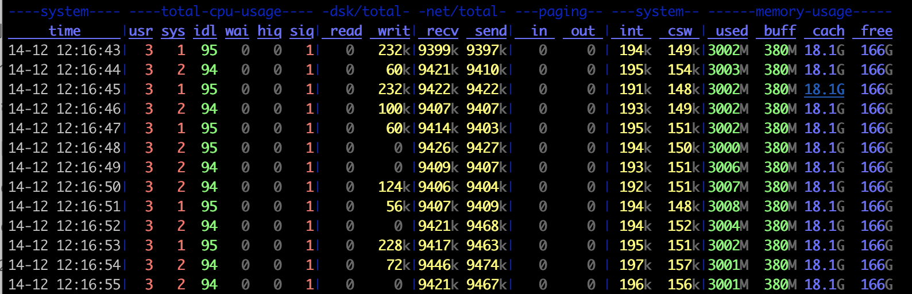

server:

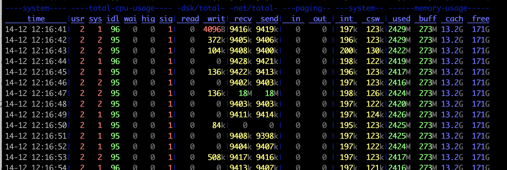

##### 2. client log

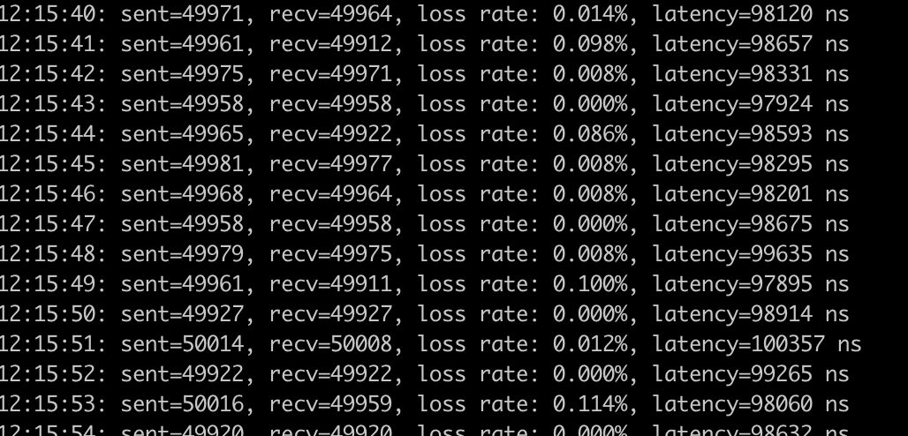

### 4.3 100万 QPS 压测

##### 1. dstat

client:

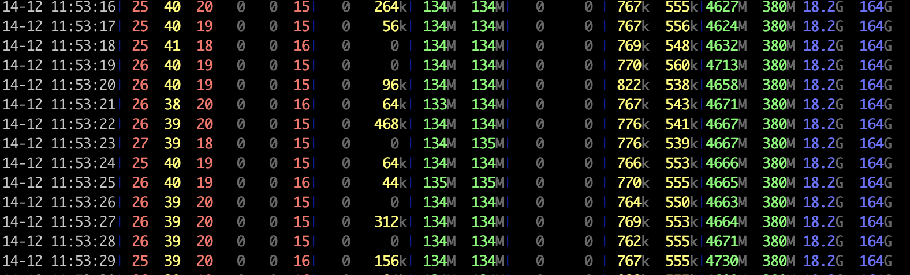

server:

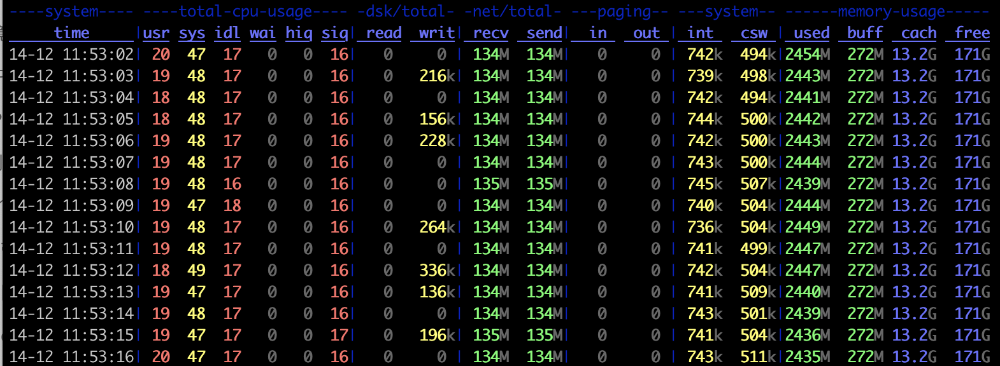

##### 2. client log

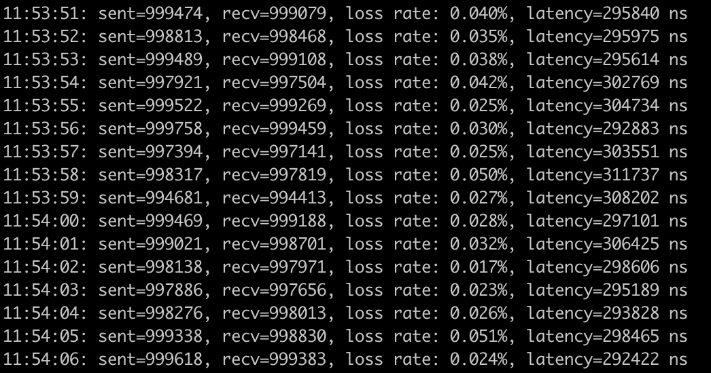

### 4.4 200万 QPS 压测

##### 1. dstat

client:

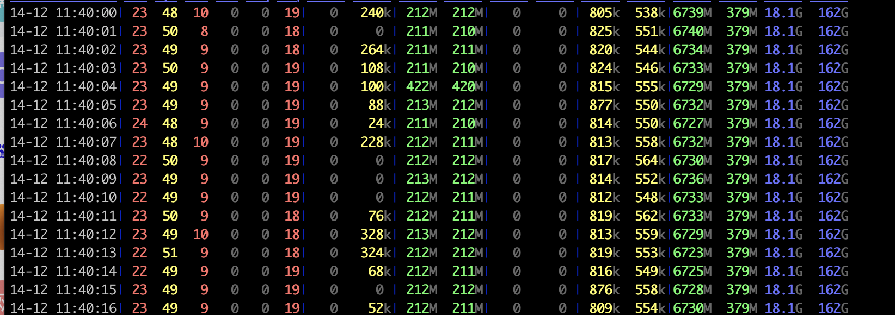

server:

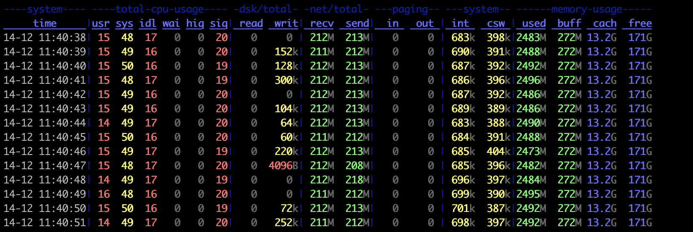

##### 2. client log

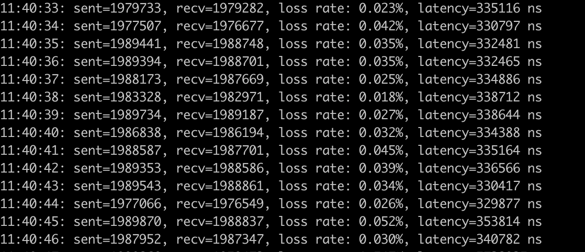

### 4.5 300万 QPS 压测

##### 1. dstat

client: 

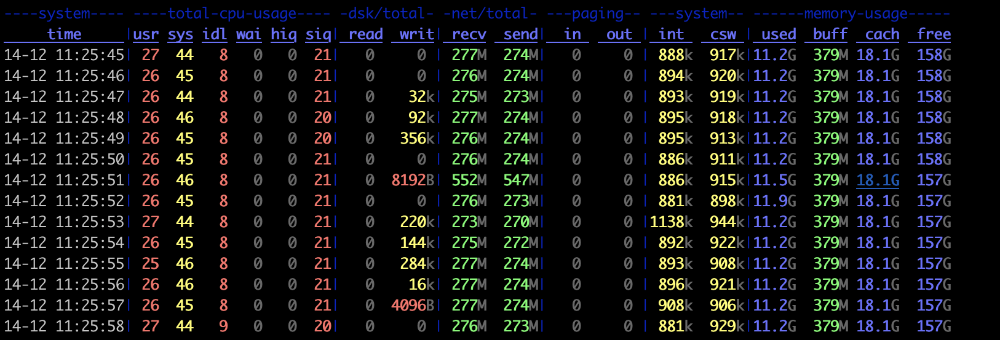

server:

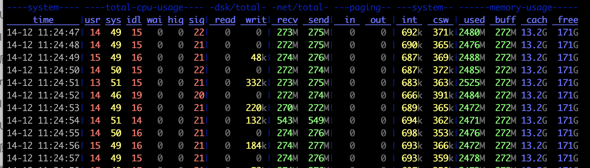

##### 2. client log

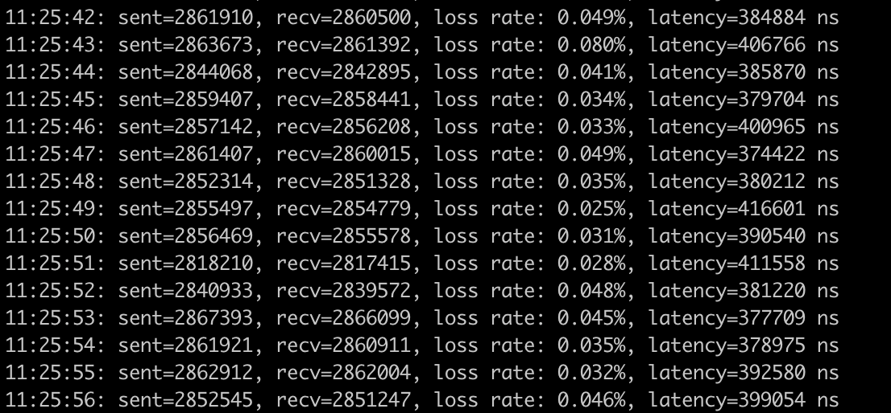
